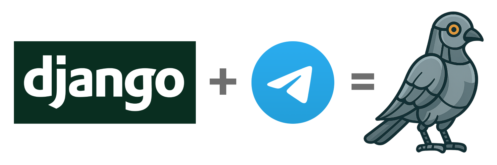

<h1 align="center">
  Django Telegram App
</h1>

  

Welcome to **django-telegram-app**, a reusable Django application that makes it easy to build Telegram bots using a clean, structured, and Django‑friendly architecture.

## What is django-telegram-app?

`django-telegram-app` is a framework for building Telegram bots using Django’s conventions:

- commands are Python classes,
- multi‑step flows are modeled using steps,
- callback data is stored safely in your database (no long query strings are sent to telegram),
- your chat's settings are stored in a **swappable Django model**,
- test utilities let you simulate Telegram updates easily,
- webhook handling is built‑in.

Instead of writing low‑level Telegram API code, you focus on **declarative bot commands**.

## Who is this for?

This library is ideal if you are:

- a **Django developer** who wants to build Telegram bots,
- someone who prefers **structured, testable** Python code,
- working on bots with **multi‑step interactions**,
- integrating your bot with Django models or business logic.

## What problems does it solve?

Telegram bots usually require you to:

- manage callback data manually,
- store state somewhere (JSON? Redis? The void?),
- deal with messy update formats,
- write routing logic for every command,
- handle typing input vs callback actions,
- test flows by mocking raw HTTP payloads.

`django-telegram-app` solves these problems by giving you:

- a **BaseBotCommand** class,
- a **Step** class to organize conversations,
- normalized update objects,
- persistent callback tokens,
- typed test helpers,
- and a swappable settings model tied to each chat.

## Getting started

To set up your bot, follow the step-by-step guide in  
➡️ [Getting started](tutorials/getting-started.md)

## Support

See our issue tracker at: [https://github.com/shifqu/django-telegram-app/issues](https://github.com/shifqu/django-telegram-app/issues){: target="_blank"}

## License

This project is licensed under the MIT License — see the [`LICENSE`](https://github.com/shifqu/django-telegram-app/blob/main/LICENSE){: target="_blank"} file for details.

## About the Mascot

The project’s mascot is a robotic pigeon — inspired by the historical use of carrier pigeons to deliver messages reliably over long distances.  
The robotic design reflects the robustness and sturdiness of the Django framework, while symbolizing automation and modern messaging flows.  
Together, it represents a blend of tradition and technology: a dependable messenger for the world of Telegram bots.